# Foodie
Foodie is a social media platform created specifically for food, drink, and restaurant enthusiasts. It provides a space where users can share captivating images and engage in interesting conversations about their culinary experiences.

Based on Code Institute's Moments Walkthrough, I have modified and customized Foodie to suit my specific purposes as part of my Full Stack Software Development portfolio project. The platform aims to offer users an immersive and exciting experience, allowing them to explore a diverse range of delicious dishes, delightful drinks, and valuable restaurant recommendations. Foodie is all about celebrating and discovering the vibrant world of food and beverages.

[View Live Project](https://pp5-capell-745fa2049c09.herokuapp.com/)

[View GitHub Repository](https://github.com/CharlieApell/project_portfolio_5)

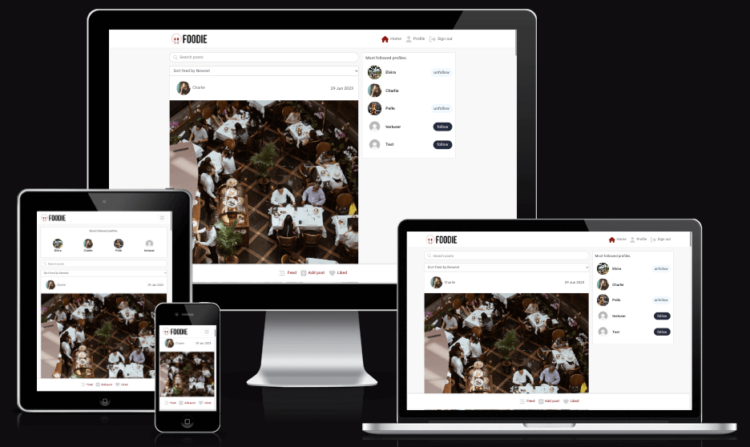

***
## Table of contents
- [UX](#UX)
    - [User Stories](#user-stories)
    - [Development Planes](#development-planes)
    - [Design](#design)
- [Features](#features)
    - [Design Features](#design-features) 
    - [Features to Implement in the future](#features-to-implement-in-the-future)
- [Bugs and Issues](#bugs-and-issues)
- [Technologies Used](#technologies-used)
     - [Main Languages Used](#main-languages-used)
     - [Frameworks, Libraries & Programs Used](#frameworks-libraries--programs-used)
- [Testing](#testing)
     - [Testing.md](TESTING.md)
- [Deployment](#deployment)
     - [Deploying on Heroku](#Deploying-on-Heroku)
     - [Forking the Repository](#Forking-the-Repository)
     - [Creating a Clone](#Creating-a-Clone)
- [Credits](#Credits)
     - [Media](#Media)
     - [Code](#Code)
- [Acknowledgements](#Acknowledgements)

***
## UX 

### User Stories:
- [User Stories](https://github.com/CharlieApell/project_portfolio_5/issues)
- [Kanban Board](https://github.com/users/CharlieApell/projects/7)


***
## Development Planes
In order to create a comprehensive and engaging website, I researched various social media platforms to identify the essential features and functionalities.

### Strategy
The website aims to target three main categories of users:
- **Roles:**
    - User
    - Admin

- **Demographic:**
    - Food and drink enthusiasts
    - People who appreciate visually appealing culinary content
    - Home cooks and chefs
    - Individuals seeking inspiration for new recipes and culinary experiences

- **Psychographics:**
    - Personality & Attitudes:
        - Adventurous
        - Appreciative of culinary creativity
        - Tired of mainstream social media content
    - Values:
        - "Life's to short for bad food"
    - Lifestyles:
        - Individuals interested in food, beverages and restaurants

The website needs to provide the following capabilities for the **user:**
- Browse a feed of pictures with food and beverages.
- Be able to edit their profile page to make it more personal.
- Register and log in to enable them to comment and like posts.
- Edit and delete their own comments and posts.

The website needs to provide the following capabilities for the **admin:**
- delete comments, posts and accounts.


### Scope
A scope was defined to identify what needed to be done to align features with the strategy previously defined. This was broken into two categories:
- **Content Requirements**
     - Users will expect to find::
          - A comprehensive collection of food images.
          - User comments and likes displayed on each posts.

- **Functionality Requirements**
     - Users should be able to:
          - Navigate the website easily.
          - Be able to select posts they wish to see.
          - Comment on and like posts.

***

### Structure
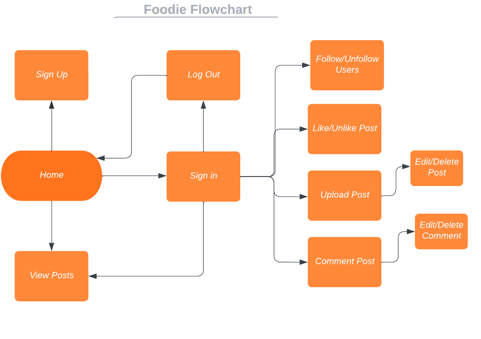

***
### Wireframes
Home Page<br>


Home Page Logged In<br>


Post Page<br>


Create Post<br>


Profile Page<br>


***

### Database Schema for the API


***
## Design

### Colour Scheme
I chose to use a clean look for the website.


### Logo & Typography
The Foodie logo was made with [Looka](https://looka.com/onboarding)<br>

I chose the Roboto font and Sans-serif for the Foodie website to match its style and overall look. To keep things consistent and easy to implement, I used the same fonts throughout the rest of the website. This decision helped me maintain a balance between staying true to the brand's identity and ensuring a smooth design process. The result is a visually appealing and unified website that fits seamlessly together.


### Imagery

Some of the images are my own and some are from [Unsplash](https://unsplash.com/ 'Unsplash website').

***
## Features

### Design Features
Each page of the website features a consistent responsive navigational system:

***
- **The Header** section of the website features a logo positioned in the top left corner, serving as a link to the home page. Adjacent to the logo is the navigation bar, which transforms into a horizontal dropdown menu on smaller screens to optimize space. 

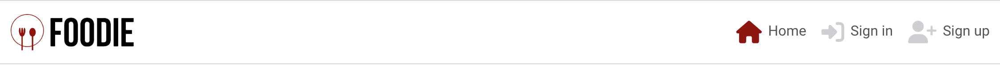

***
- **The Footer** section is only showned to logged in users and is primarily designed to provide easy access to the feed, upload content and liked posts.

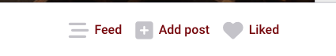

***
- **The Home page when not logged in**, which is the first page users encounter when visiting the domain, displays a welcome message exclusively for non-logged-in users. It provides easy access to all the posts and serves as the starting point for exploring the website.

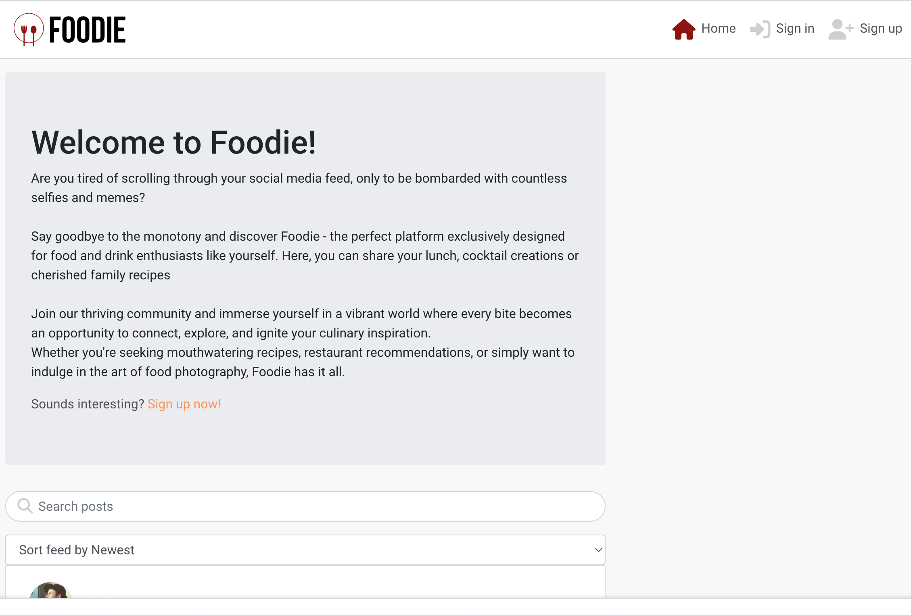

***
- **The Home page** serves as the initial landing page where users can immediately access all the posts.

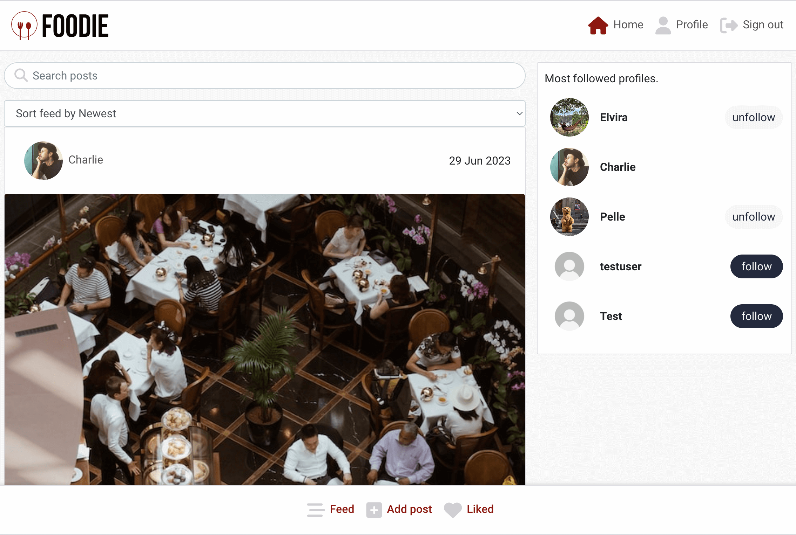

***
- **The Sign In** functionality allows users to log into their accounts using their credentials, such as a username and password, granting them full access to personalized features and content.

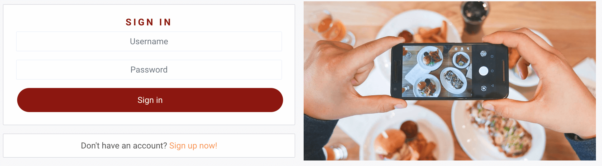

***
- **The Sign Up** option allows new users to create an account on the platform. By providing essential information such as a username and password, users can register and become part of the community. This enables them to save their preferences, engage with other users, and unlock additional features available on the platform.

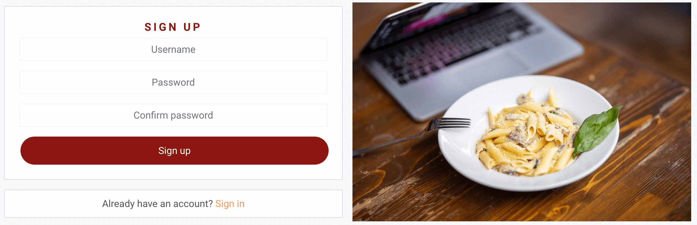

***
- **The Profile Page** displays a user's uploaded images, follower count, and following count. Users can also edit their profile, change their username and password, allowing them to update their information and profile picture. It serves as a central hub for users to manage their presence on the platform and showcase their content.

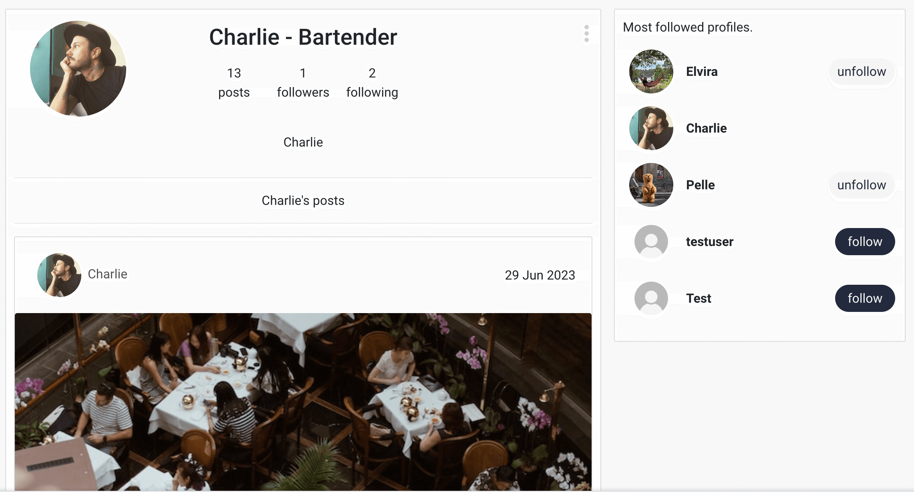
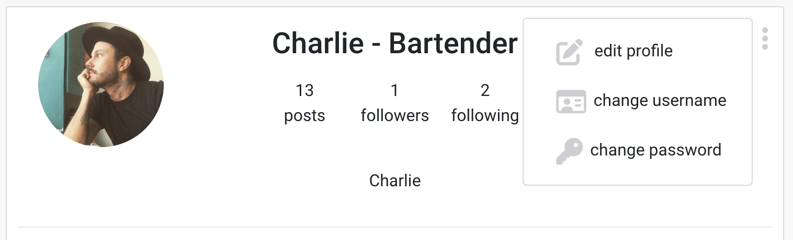
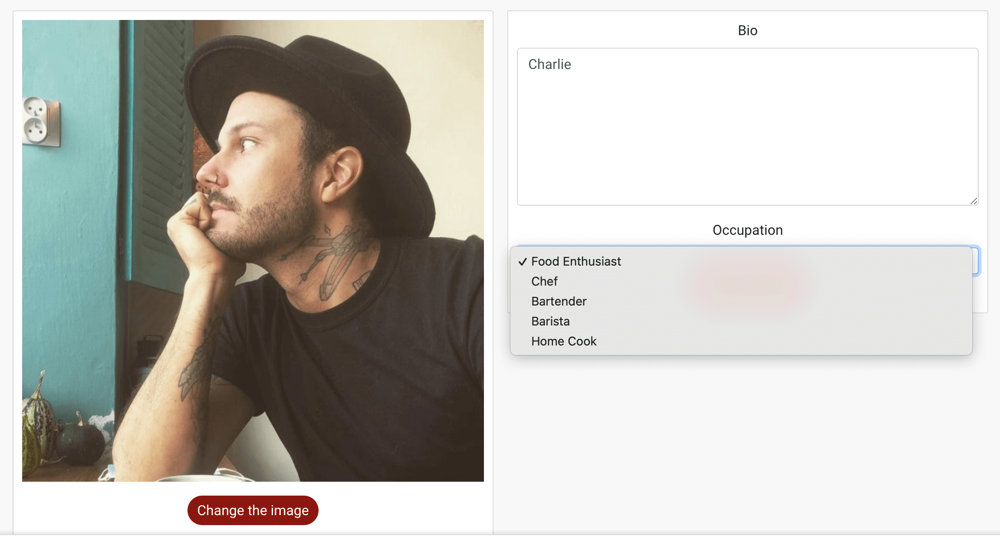

***
- **The Search Bar and Filtering**, where users can search and filter through posts by newest, most liked or most commented. This search functionality provides a convenient way for users to find specific posts of interest.

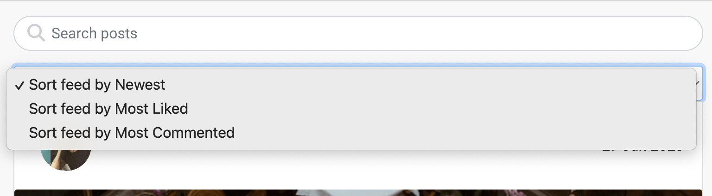

***
- **The Upload page**, users can easily share their content by uploading an image and providing a title and accompanying information. It's a simple process that allows users to quickly select and upload their desired image while also adding relevant details for others to see.

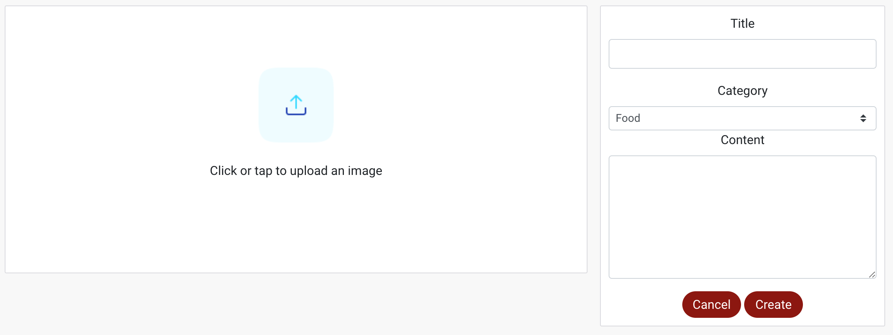

***
- **The Post page**, when you click on an image, you will be directed to the corresponding page where you can view the full post. Here, you can not only leave comments to engage with the content and share your thoughts, but you also have the ability to delete your own post or comment. If you choose to delete your post or comment, a warning prompt will appear, ensuring that you have a chance to confirm your decision before permanently removing your content.

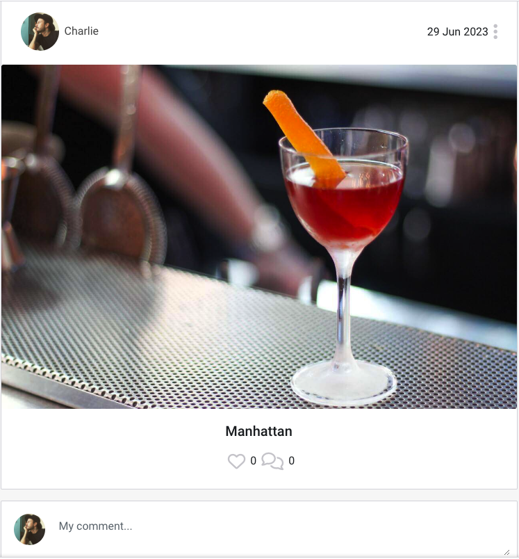
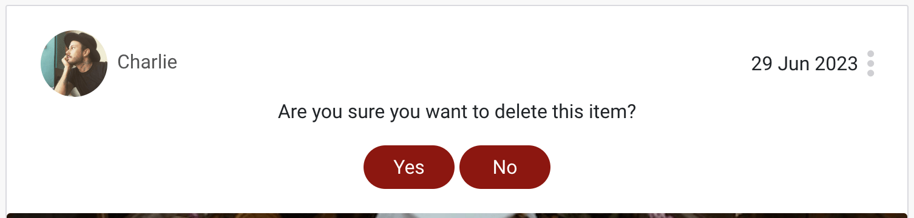
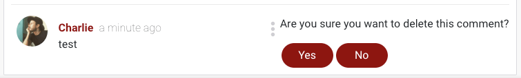

***
- **The Edit Post page** provides you with the option to modify your post if you are not satisfied with it. On this page, you can make changes and updates to your content, allowing you to refine and improve your entry according to your desired specifications.

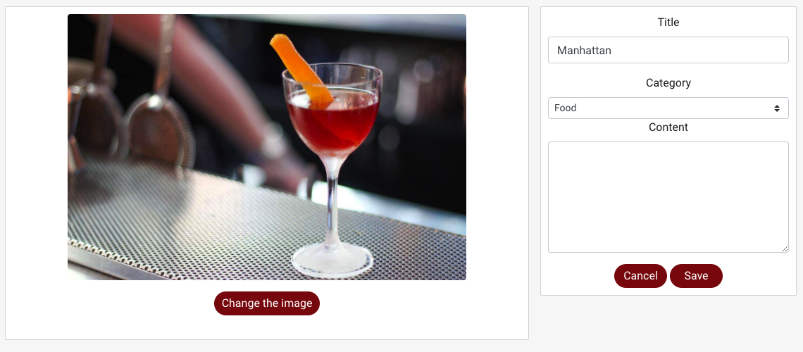

***
- **Popular Profiles** visible across all pages and updated in real-time, highlights the top five most followed users. This dynamic feature offers a quick snapshot of the community's most popular members, serving as a source of inspiration for others to explore and engage with their profiles.

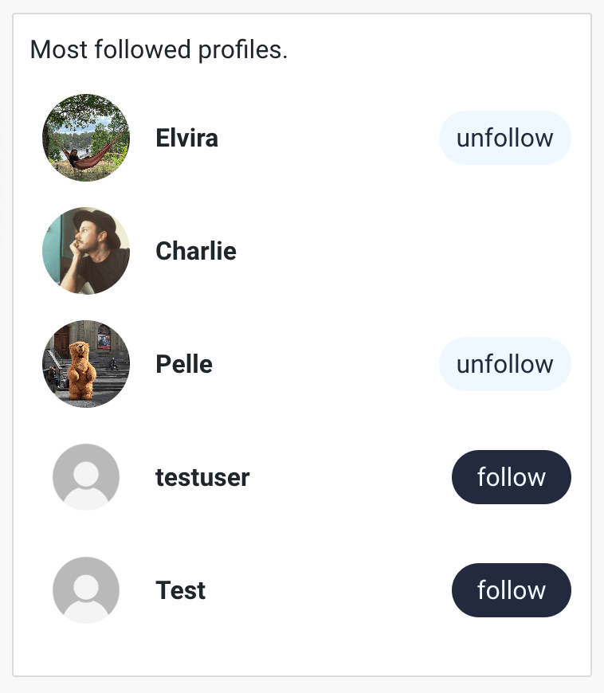

***
### Features to Implement in the future
- **Restaurant Ratings**
     - **Feature:**  Users can rate and provide feedback for restaurants they have visited, allowing others to make informed dining choices.
     - **Reason for not featuring in this release:** Due to time constraints, the restaurant rating feature was not implemented before the project's deadline. However, it is planned to be developed in the future after the current phase of the project is completed and evaluated.
- **Delete Account**
     - **Feature:** Users have the ability to delete their own account if they no longer wish to be a member of the platform.
     - **Reason for not featuring in this release:** Due to project time constraints, the delete account feature was not included in the initial release. However, it is acknowledged as an important functionality and will be considered for implementation in future iterations after the grading process is completed.

***
## Bugs and Issues 

**Bug** - Searchbar didn't return images category.
- ***Solution***: To resolve this, I made a modification in my posts/views.py file in my API to ensure that the category was a part of the search_field.

**Bug** - Couldn't start the development browser with npm start.
- ***Solution***: Had to use nvm install 16 && nvm use 16 to make it work.

**Issue** - Occasionally, I encounter a frustrating issue where I am unable to click on any links or images within the web application. The only solution I have found so far is to manually refresh the page, after which the links and images become responsive again. I have attempted to search for solutions online, but unfortunately, I have not been able to find any relevant answers. Regrettably, due to time constraints, I have been unable to invest further efforts into resolving this issue.

***
## Technologies Used
### Main Languages Used
- [HTML5](https://en.wikipedia.org/wiki/HTML5 "Link to HTML Wiki")
- [CSS3](https://en.wikipedia.org/wiki/Cascading_Style_Sheets "Link to CSS Wiki")
- [JavaScript](https://en.wikipedia.org/wiki/JavaScript "Link to JavaScript Wiki")
- [Python](https://en.wikipedia.org/wiki/Python_(programming_language) "Link to Python Wiki")

### Frameworks, Libraries & Programs Used
- [React](https://react.dev/ "Link to React website")
     - React was used to build the app and served as a foundation of this project.
- [React-Bootstrap](https://react-bootstrap-v4.netlify.app/ "Link to React-Bootstrap website")
     - React-Bootstrap was used to implement site responsiveness by utilizing React-Bootstrap classes.
- [Django](https://www.djangoproject.com/ "Link to Django Project website")
     - Django was used to build the models, forms, and views of the API.
- [Cloudinary](https://cloudinary.com/ "Link to Cloudinary page")
     - Cloudinary was used as free cloud storage for images uploaded.
- [Google Fonts](https://fonts.google.com/ "Link to Google Fonts")
     - Google Fonts were used consistently across the entire website.
- [Font Awesome](https://fontawesome.com/ "Link to FontAwesome")
     - Font Awesome icons were utilized to enhance the user experience.
- [Git](https://git-scm.com/ "Link to Git homepage")
     - Git was utilized for version control. The GitPod terminal was used for committing changes and pushing them to the GitHub repository.
- [GitHub](https://github.com/ "Link to GitHub")
     - GitHub served as the platform for storing the project's code, providing a centralized repository for collaboration and version management.
- [Am I Responsive?](http://ami.responsivedesign.is/# "Link to Am I Responsive Homepage")
     - Am I Responsive was used to test the responsive design of the website.
- [Balsamiq](https://balsamiq.com/ "Link to Balsamiq")
     - Balsamiq was used to make the wireframes.
- [Lucidchart](https://lucid.app/ "Link to Lucidchart")
     - Lucidchart was used to make the database schema.

***
## Testing

Testing information can be found in a separate [testing file](TESTING.md "Link to testing file").

***
## Deployment

This project was developed using a [GitPod](https://gitpod.io/ "Link to GitPod") workspace. The code was commited to [Git](https://git-scm.com/ "Link to Git") and pushed to [GitHub](https://github.com/ "Link to GitHub") using the terminal.

### Deploying on Heroku
To deploy this page to Heroku from its GitHub repository, the following steps were taken:

1. Create the Heroku App:
    - Select "Create new app" in Heroku.
    - Choose a name for your app and select the location.

2. Attach the Postgres database:
    - In the Resources tab, under add-ons, type in Postgres and select the Heroku Postgres option.

3. Prepare the environment and settings.py file:
    - In the Settings tab, click on Reveal Config Vars and copy the url next to DATABASE_URL.
    - In your GitPod workspace, create an env.py file in the main directory. 
    - Add the DATABASE_URL value and your chosen SECRET_KEY value to the env.py file.
    - Add the SECRET_KEY value to the Config Vars in Heroku.
    - Update the settings.py file to import the env file and add the SECRETKEY and DATABASE_URL file paths.
    - Update the Config Vars with the Cloudinary url, adding into the settings.py file also.
    - In settings.py add the following sections:
        - Cloudinary to the INSTALLED_APPS list
        - STATICFILE_STORAGE
        - STATICFILES_DIRS
        - STATIC_ROOT
        - MEDIA_URL
        - DEFAULT_FILE_STORAGE
        - TEMPLATES_DIR
        - Update DIRS in TEMPLATES with TEMPLATES_DIR
        - Update ALLOWED_HOSTS with ['app_name.heroku.com', 'localhost']

4. Store Static and Media files in Cloudinary and Deploy to Heroku:
    - Create three directories in the main directory; media, storage and templates.
    - Create a file named "Procfile" in the main directory and add the following:
        - web: gunicorn project-name.wsgi
    - Log in to Heroku using the terminal heroku login -i.
    - Then run the following command: **heroku git:remote -a your_app_name_here** and replace your_app_name_here with the name of your Heroku app. This will link the app to your Gitpod terminal.
    - After linking your app to your workspace, you can then deploy new versions of the app by running the command **git push heroku main** and your app will be deployed to Heroku.

***
### Forking the Repository
By forking the GitHub Repository we make a copy of the original repository on our GitHub account to view and/or make changes without affecting the original repository by using the following steps...

1. Log into [GitHub](https://github.com/login "Link to GitHub login page") or [create an account](https://github.com/join "Link to GitHub create account page").
2. Locate the [GitHub Repository](https://github.com/Kat632/PP4-LettuceEat "Link to GitHub Repo").
3. At the top of the repository, on the right side of the page, select "Fork"
4. You should now have a copy of the original repository in your GitHub account.

***
### Creating a Clone
How to run this project locally:
1. Install the [GitPod Browser](https://www.gitpod.io/docs/browser-extension/ "Link to Gitpod Browser extension download") Extension for Chrome.
2. After installation, restart the browser.
3. Log into [GitHub](https://github.com/login "Link to GitHub login page") or [create an account](https://github.com/join "Link to GitHub create account page").
2. Locate the [GitHub Repository](https://github.com/Kat632/PP4-LettuceEat "Link to GitHub Repo").
5. Click the green "GitPod" button in the top right corner of the repository.
This will trigger a new gitPod workspace to be created from the code in github where you can work locally.

How to run this project within a local IDE, such as VSCode:

1. Log into [GitHub](https://github.com/login "Link to GitHub login page") or [create an account](https://github.com/join "Link to GitHub create account page").
2. Locate the [GitHub Repository](https://github.com/Kat632/PP4-LettuceEat "Link to GitHub Repo").
3. Under the repository name, click "Clone or download".
4. In the Clone with HTTPs section, copy the clone URL for the repository.
5. In your local IDE open the terminal.
6. Change the current working directory to the location where you want the cloned directory to be made.
7. Type 'git clone', and then paste the URL you copied in Step 3.
```
git clone https://github.com/USERNAME/REPOSITORY
```
8. Press Enter. Your local clone will be created.

Further reading and troubleshooting on cloning a repository from GitHub [here](https://docs.github.com/en/free-pro-team@latest/github/creating-cloning-and-archiving-repositories/cloning-a-repository "Link to GitHub troubleshooting")

***
## Credits 
### Deployment
- Copied from my PP4

### Media
- Some images have been sourced from [Unsplash](https://unsplash.com) others are my own.

### Code 
References used:
- [Code Institute Moments Walkthrough](https://github.com/Code-Institute-Solutions/moments "Link to Code Institute Moments Repository")
- [Stack Overflow](https://stackoverflow.com/ "Link to Stack Overflow page")
- [React-Bootstrap](https://react-bootstrap-v4.netlify.app/ "Link to BootStrap page")
- [Codemy](https://www.youtube.com/playlist?list=PLCC34OHNcOtr025c1kHSPrnP18YPB-NFi "Link to Codemy's YouTube")

***
## Acknowledgements

I would like to acknowledge the following sources that have provided inspiration and guidance for the development of this project:

- Code Institute's Moments Walkthrough: I would like to acknowledge Code Institute's Moments Walkthrough for providing a foundation of code that I have modified to suit the specific needs and purposes of Foodie. The Moments Walkthrough served as a valuable reference, and I am grateful for the code snippets and concepts it provided, which I have adapted and customized to align with the vision and functionality of Foodie.

- Code Institute's Slack Community: The supportive and knowledgeable community on Code Institute's Slack platform has been instrumental in providing assistance and insights throughout the development process. The prompt responses and collaborative discussions have been immensely helpful in overcoming challenges and finding solutions.

- Emelie Markkanen's PP5 Garden Diary: Inspiration and code concepts influenced certain aspects of Foodie, such as the Jumbotron.

- Pablo Embarach's PP5 Coffeeie-API: Inspiration and code concepts influenced certain aspects of Foodie, such as the category and occupation.

- Niclas Tanskanen's PP5 Snap Tap App, have influenced the development of some features in Foodie.

- Andy Guttridge's PP5 Tribehub, has provided guidance for certain aspects of Foodie's development.

I am grateful for the inspiration and resources provided by these sources, which have played a significant role in the successful completion of this project.

***